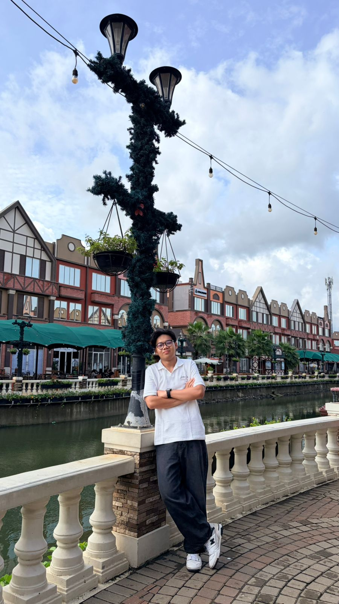

# Portfolio Website - Darel Prasetya Fawwaz

Website portofolio pribadi yang dibuat sebagai tugas Praktikum Pemrograman Berbasis Web.

---

## Teknologi yang Digunakan

| Teknologi | Kegunaan |
|---|---|
| HTML | Struktur halaman website |
| CSS | Styling tampilan, warna, dan layout |
| Bootstrap 5 | Navbar, grid system, card, button, utilities |
| Vue JS | Menampilkan skill, pengalaman, dan sertifikat |

---

## Tampilan Setiap Section

### Navbar
Navbar ada di bagian paling atas halaman, warna gelap dengan garis bawah oranye. Isinya nama dan tiga link buat pindah ke section Home, About Me, dan Certificates.


---

### Section Home
Bagian pertama yang muncul waktu buka website. Sebelah kiri ada nama, prodi, deskripsi singkat, dan dua tombol. Sebelah kanan ada foto profil yang dibuat bulat.


---

### Section About Me
Ada tiga bagian di sini. Kartu Info Diri berisi bio singkat sama info kontak. Kartu Skill menampilkan progress bar. Terus ada bagian Pengalaman yang isinya kartu-kartu pengalaman organisasi.


---

### Section Certificates
Menampilkan daftar sertifikat dalam bentuk grid tiga kolom. Tiap kartu ada gambar sertifikat, judul, penerbit, sama tanggal atau tahun.


---

### Footer
Bagian paling bawah, background gelap dengan garis atas oranye. Isinya nama dan tulisan singkat.


---

## Penjelasan Code Setiap Section

### Navbar
Navbar pakai komponen bawaan Bootstrap 5. Class `navbar-expand-lg` yang bikin navbar otomatis jadi tombol hamburger waktu dibuka di HP. `ms-auto` buat dorong menu ke kanan.

```
<!-- navbar -->
<nav class="navbar navbar-expand-lg navbar-dark" id="navbar">
<div class="container">

    <a class="navbar-brand fw-bold" href="#">Darel Prasetya Fawwaz</a>

    <button class="navbar-toggler" type="button" data-bs-toggle="collapse" data-bs-target="#menuNavbar">
    <span class="navbar-toggler-icon"></span>
    </button>

    <div class="collapse navbar-collapse" id="menuNavbar">
    <ul class="navbar-nav ms-auto">
        <li class="nav-item">
        <a class="nav-link" href="#home">Home</a>
        </li>
        <li class="nav-item">
        <a class="nav-link" href="#about">About Me</a>
        </li>
        <li class="nav-item">
        <a class="nav-link" href="#certificates">Certificates</a>
        </li>
    </ul>
    </div>

</div>
</nav>
```

---

### Section Home
Layout-nya pakai grid Bootstrap, `col-md-7` buat teks dan `col-md-5` buat foto supaya bisa sejajar. `align-items-center` bikin keduanya rata tengah. Foto dibuat bulat lewat CSS pakai `border-radius: 50%`.

```
<!-- home -->
<section id="home">
<div class="container">
    <div class="row align-items-center gy-4">

    <!-- teks kiri -->
    <div class="col-md-7">
        <p class="teks-halo">Halo, nama saya</p>
        <h1 class="nama-besar">Darel Prasetya Fawwaz</h1>
        <h5 class="jurusan-teks">Mahasiswa Sistem Informasi</h5>
        <p class="deskripsi-teks">
        Saya Darel Prasetya Fawwaz Mahasiswa Universitas Mulawarman, Fakultas Teknik, Program Studi Sistem informasi. 
        Saya tertarik dengan dunia teknologi, terutama pengembangan web. 
        Saya juga suka menonton sepak bola terutama tim favorit saya FC Barcelona, dan saya hobi bermain futsal.
        </p>
        <a href="#about" class="btn btn-oren me-2">Tentang Saya</a>
        <a href="#certificates" class="btn btn-outline-oren">Lihat Sertifikat</a>
    </div>

    <!-- foto kanan -->
    <div class="col-md-5 text-center">
        
    </div>

    </div>
</div>
</section>
```

---

### Section About Me 
```
<!-- about me -->
<section id="about">
<div class="container">

    <h2 class="judul-section text-center">About Me</h2>

    <div class="row g-4">

<!-- info diri -->
    <div class="col-md-5">
        <div class="kartu-gelap h-100">
        <h5 class="fw-bold mb-3">
            <i class="bi bi-person-circle me-2 warna-oren"></i>Info Diri
        </h5>
        <p class="teks-abu">
            Halo! Saya Darel, mahasiswa semester 4. culers sejati
        </p>
        <hr class="garis" />
        <p><i class="bi bi-geo-alt me-2 warna-oren"></i><strong>Kota:</strong> Tenggarong, Kalimantan Timur</p>
        <p><i class="bi bi-envelope me-2 warna-oren"></i><strong>Email:</strong> darel2227@email.com</p>
        <p class="mb-0"><i class="bi bi-mortarboard me-2 warna-oren"></i><strong>Prodi:</strong> Sistem Informasi</p>
        </div>
    </div>
```

### Section About Me - Skill (Vue JS)
Bagian skill pakai Vue JS. Elemen `id="app-skill"` jadi tempat Vue aktif. `v-for` dipakai buat looping data skill satu-satu, terus `{{ skill.nama }}` dan `{{ skill.nilai }}` buat nampilin teksnya ke layar. Lebar progress bar-nya nyambung ke data skill lewat `:style`.
```
    <!-- skill -->
    <div class="col-md-7">
        <div class="kartu-gelap h-100" id="app-skill">
        <h5 class="fw-bold mb-4">
            <i class="bi bi-lightning me-2 warna-oren"></i>Skill
        </h5>

        <div v-for="skill in skills" :key="skill.nama" class="mb-3">
            <div class="d-flex justify-content-between mb-1">
            <span>{{ skill.nama }}</span>
            <span class="warna-oren fw-bold">{{ skill.nilai }}%</span>
            </div>
            <div class="progress" style="height: 8px; background-color: #2a2a2a;">
            <div
                class="progress-bar"
                role="progressbar"
                :style="'width: ' + skill.nilai + '%'"
                :aria-valuenow="skill.nilai"
                aria-valuemin="0"
                aria-valuemax="100">
            </div>
            </div>
        </div>

        </div>
    </div>

    </div>
```    
```js
// skill
createApp({
    data() {
    return {
        skills: [
        { nama: 'HTML & CSS',  nilai: 50 },
        { nama: 'Futsal',      nilai: 80 },
        { nama: 'Culers',       nilai: 100 },
        { nama: 'Olahraga apa aja',      nilai: 90 },
        ]
    }
    }
}).mount('#app-skill')
```

### Section About Me - Pengalaman (Vue JS)
Sama kayak skill, pengalaman juga pakai Vue JS. `id="app-pengalaman"` jadi titik mount-nya, terus `v-for` looping dari array `pengalaman`. Grid Bootstrap `col-md-6` dipakai supaya kartunya tampil dua kolom di layar yang lebih lebar.

```html
    <!-- pengalaman -->
    <h4 class="fw-bold mt-5 mb-4">
    <i class="bi bi-briefcase me-2 warna-oren"></i>Pengalaman
    </h4>
    <div class="row g-3" id="app-pengalaman">

    <div class="col-md-6" v-for="exp in pengalaman" :key="exp.posisi">
        <div class="kartu-gelap border-oren-kiri">
        <h6 class="fw-bold mb-1">{{ exp.posisi }}</h6>
        <p class="teks-abu small mb-1">
            <i class="bi bi-building me-1"></i>{{ exp.tempat }}
        </p>
        <p class="teks-abu small mb-2">
            <i class="bi bi-calendar me-1"></i>{{ exp.periode }}
        </p>
        <p class="small mb-0">{{ exp.deskripsi }}</p>
        </div>
    </div>

    </div>

</div>
</section>
```
```js
// pengalaman
createApp({
    data() {
    return {
        pengalaman: [
        {
            posisi: 'Anggota Divisi Passion Talent Center',
            tempat: 'Information System Association',
            periode: 'Feb 2025 - Dec 2025',
            deskripsi: 'Membantu menjalankan program kerja dengan penuh tanggung jawab.'
        },
        {
            posisi: 'Anggota Divisi Publikasi & Dokumentasi',
            tempat: 'APLIKASI 2025',
            periode: 'Oktober 2025 - November 2025',
            deskripsi: 'Mendokumentasikan kegiatan dan mempublikasikan informasi kegiatan.'
        },

        ]
    }
    }
}).mount('#app-pengalaman')
```

---

### Section Certificates (Vue JS)
Sertifikat pakai Vue JS biar gampang kalau mau nambah atau ganti data. `id="app-sertifikat"` jadi titik mount, terus `v-for` looping dari array `sertifikat`. Gambarnya nyambung ke data pakai `:src` dan `:alt`.

```html
<!-- sertifikat -->
<section id="certificates">
<div class="container">

    <h2 class="judul-section text-center">Certificates</h2>
    <p class="text-center sub-judul mb-5">Sertifikat yang sudah saya dapat</p>

    <div class="row g-4" id="app-sertifikat">

    <div class="col-md-6 col-lg-4" v-for="cert in sertifikat" :key="cert.judul">
        <div class="kartu-gelap h-100 p-0 overflow-hidden">
        
        <div class="p-3">
            <h6 class="fw-bold mb-1">{{ cert.judul }}</h6>
            <p class="teks-abu small mb-1">
            <i class="bi bi-award me-1 warna-oren"></i>{{ cert.penerbit }}
            </p>
            <p class="teks-abu small mb-0">
            <i class="bi bi-calendar me-1 warna-oren"></i>{{ cert.tanggal }}
            </p>
        </div>
        </div>
    </div>

    </div>

</div>
</section>
```
```js
// sertifikat
createApp({
    data() {
    return {
        sertifikat: [
        {
            judul: 'Kepanitiaan Information System Association',
            penerbit: 'Information System Association',
            tanggal: 'Feb 2025 - Dec 2025',
            gambar: 'inforsa.PNG'
        },
        {
            judul: 'Kepanitiaan APLIKASI 2025',
            penerbit: 'Departemen HRD Information System Association',
            tanggal: '2025',
            gambar: 'pubdok.jpeg'
        },
        {
            judul: 'Kepanitiaan ITECH 2025',
            penerbit: 'Departemen PSD information System Association',
            tanggal: '2025',
            gambar: 'itech.jpeg'
        },
        {
            judul: 'Kepanitiaan Independence Competition 2025',
            penerbit: 'Departemen PSD Information System Association',
            tanggal: '2025',
            gambar: 'indepcomp.jpeg'
        },
        {
            judul: 'Kepanitiaan Information System Competition 2025',
            penerbit: 'Departemen PSD Information System Association',
            tanggal: '2025',
            gambar: 'isc.jpeg'
        },
        {
            judul: 'Kepanitiaan Knowledge Center 2025',
            penerbit: 'Departemen PSD Information System Association',
            tanggal: '2025',
            gambar: 'kc.jpeg'
        },

        ]
    }
    }
}).mount('#app-sertifikat')
```

---

### Footer
Footer dibuat dan distyling dengan Background gelap dan garis atas oranye diatur di `style.css`.

```html
<!-- footer -->
<footer>
<div class="container text-center">
    <p class="mb-1 fw-bold">Darel Prasetya Fawwaz</p>
    <p class="teks-abu small mb-0">visca barca</p>
</div>
</footer>
```

---
#### Darel Prasetya Fawwaz | 2409116064 | Sistem Informasi B 24 | SALAM PUCUK DINGIN viscabarca
